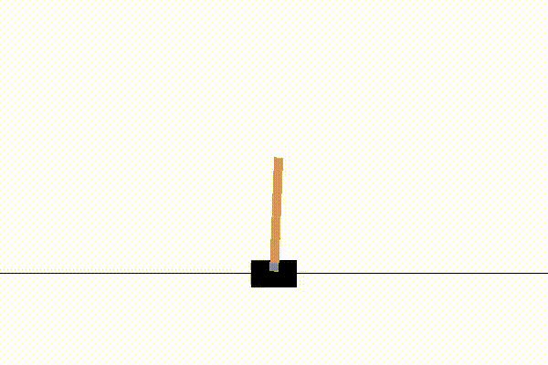
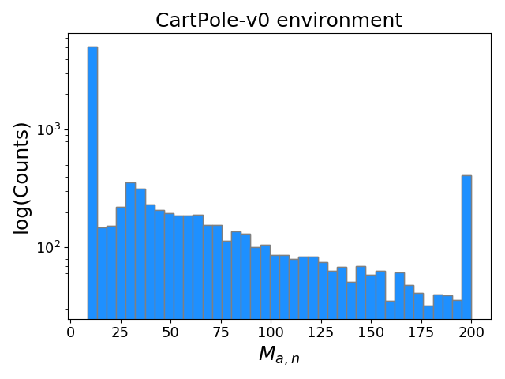
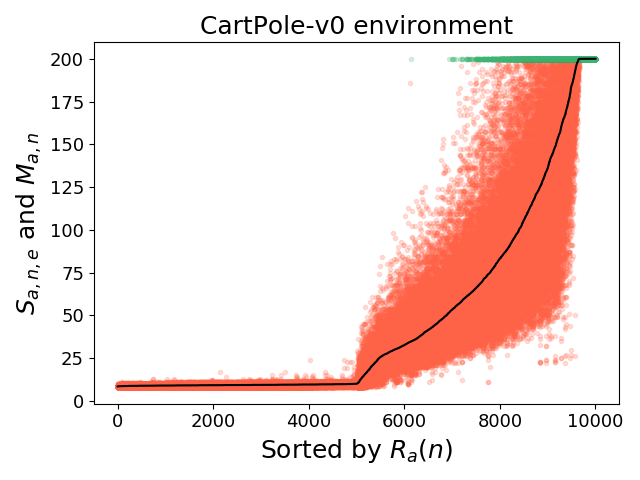
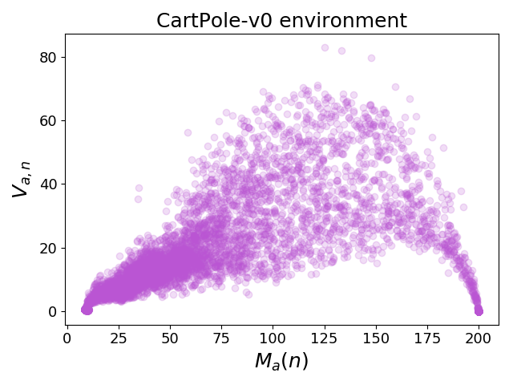

# Random Weight Guessing (RWG) benchmarking

Repository for the paper ["Analyzing Reinforcement Learning Benchmarks with Random Weight Guessing"](https://arxiv.org/abs/2004.07707), accepted for publication in AAMAS 2020.

## Overview of RWG

RWG is simply randomly guessing the weights of a neural network (NN) until it gives the desired behavior at whatever task it's being used for. There is no learning, gradient descent, or training. It should be noted that RWG is *not intended* to be an effective strategy; in fact, it's of interest because it is one of the simplest and least biased methods possible. This allows for robust and reproducible analysis of typical environments used for benchmarking reinforcement learning (RL) algorithms. Its brute force collection of statistics for a controller in an environment offers insight into the dynamics of the environment.

It might be surprising that RWG relatively easily "solves" some simpler environments. A likely hypothesis that's been put forward is that valid sets of weights are "dense" in weight-space; i.e., a relatively large portion of the possible weight sets solve the problem. For more complex environments, a more complex controller is required, and in the case of NNs, this means more weights. Although it's *possible* for RWG to "solve" a controller with any number of weights, as the number of weights increases, the volume in weight space grows exponentially (i.e., the "curse of dimensionality").

<p align="center">
  
</p>

## Overview of system

We select an OpenAI gym environment (env), and a simple NN architecture (for example, one hidden layer of 4 units, tanh nonlinearity, no bias units) to control the policy for an agent in that env. A "sample" is defined as the sampled set of weights that make up a NN controller. For each sample, it is run in the env for (`N_episodes`) episodes, because different initial env conditions give different scores for the same NN. This process is repeated `N_samples` times. To produce each sample, a set of weights is chosen from a Normal distribution with mean 0, standard deviation 1. Note that because there is no learning and nothing is sequential, all samples are independent from each other and it's highly parallelizable.

Typically, the above procedure (which generates a matrix of `N_samples` x `N_episodes` of episode scores) is repeated for `N_architectures` NN architectues as well, to form a "score tensor" of dimension `N_architectures` x `N_samples` x `N_episodes`.

Having done this for an environment, here are some of the statistics one can produce.

First, for a given NN architecture `a`, for each sample `n`, we can take its mean score across all its episodes, `M_a,n`, and form a histogram of these. Here is that, for `N_samples = 10**4` and `N_episodes = 20`:

<p align="center">
  
</p>

Note the log yscale. `CartPole-v0` is the simplest environment for RWG to solve, with ~4% of samples getting a mean score in the highest bin.

Similarly, we can rank the samples by their `M_a,n`. Here, each position on the horizontal axis corresponds to a sample, and all of the sample's episode scores are plotted at this x position (with differing y positions dependent on each episode score). The black line shows `M_a,n`, and the highlighted green dots correspond to episodes that achieved the top 0.1% of all episode scores.

<p align="center">
  
</p>

We can also plot the variance of episode scores for each sample, `V_a,n`:

<p align="center">
  
</p>


## Use

To run a simple example of RWG for the `CartPole-v0` env, we can run `python3 scripts/sample_example.py`:

```
import path_utils
from Sample import Sample

e = Sample('CartPole-v0', NN='FFNN', N_hidden_layers=0, use_bias=False)
sample_dict = e.sample(2000, N_episodes=20, print_samp_num=True)
e.save_all_sample_stats(sample_dict)
```

This runs a NN with no hidden layers, for 2000 samples, of 20 episodes each, and then plots all the results to a directory it creates in `output/`.

A slightly more complex example does the same process, for various combinations of architectures, environments, and configurations, in `scripts/stats_example.py`:

```
import path_utils
import Statistics

'''
For getting statistics with various combos of parameters.
'''

############################### Basic runs
Statistics.run_vary_params(
    {
        'NN' : 'FFNN',
        'N_hidden_units' : 4,
        'use_bias' : False,
        'max_episode_steps' : 200
    },
    {
        'env_name' : ['CartPole-v0', 'Pendulum-v0', 'MountainCar-v0'],
        'N_hidden_layers' : [1, 2],
    },
    N_samples=1000,
    N_episodes=10
)

```

In `Statistics.run_vary_params()`, two dicts are passed: the first for parameters that will remain constant across all combinations, and the second for parameters to vary. The combinations run are a cross product of all the varying parameters; in the above example, `env_name` will vary over 3 values and `N_hidden_layers` will vary over 2 values, so it will collect statistics for 3*2 = 6 total combinations.


## Details

### Hyperparameters?

As simple as this is, there are still technically hyperparameters, depending on how loosely you want to define the term:

* For the NN nonlinearity, `tanh` was used, but any other could have been.
* The NN architectures to look at have to be chosen as well.
* Similarly, we sampled the weights from a normal distribution, but another distribution could be used.
* Bias connections, see below.

### Bias connections

Bias connections are typically added to NNs for most applications. We tested both and found that including bias connections in the RWG NN controllers notably diminished the fraction of high performing NN samples across most environments (see paper for details).

### Output scaling

The 5 "classic control" envs investigated in the paper fall into two categories: three have discrete action spaces, and two have continuous action spaces. For the discrete action space envs, we simply use the argmax of the NN output units to choose the action. For continuous action spaces, the env domain can be some arbitrary range of real numbers. Therefore, since a `tanh` nonlinearity is applied to the output (thus restricting it to (-1, 1)), the `tanh` output is scaled to match the continuous action space domain.


## Relevant links

* https://github.com/giuse/tinynet
* https://www.bioinf.jku.at/publications/older/ch9.pdf
* https://gist.github.com/giuse/3d16c947259173d571cf82e28a2f7a7e
